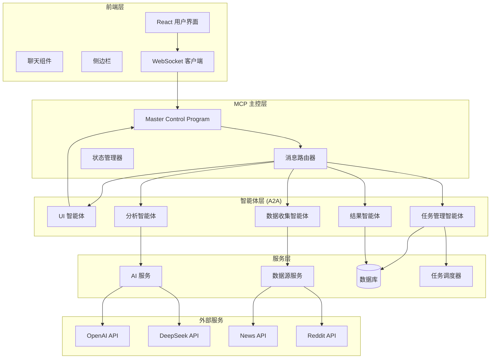

# AI 热点话题追踪器 - 技术文档

## 1. 项目概述

### 1.1 项目目标

AI 热点话题追踪器是一个基于智能体架构的 AI 应用，旨在：

- 提供自然语言对话式的用户交互体验
- 实现定时自动化的数据收集和分析
- 使用 AI 模型对收集的数据进行智能分析和总结
- 支持多种数据源和多种分析方式
- 提供实时结果推送和历史数据管理

### 1.2 核心特性

#### 前端交互特性
- **对话式界面**: 用户通过自然语言与 AI 助手对话
- **实时通信**: WebSocket 支持的实时消息推送
- **响应式设计**: 适配不同设备屏幕
- **任务管理**: 可视化的任务状态和结果展示

#### 后端处理特性
- **智能体架构**: MCP + A2A 模式的模块化设计
- **多 AI 模型**: 支持 OpenAI 和 DeepSeek API
- **定时任务**: 基于 APScheduler 的任务调度
- **多数据源**: 新闻 API、Reddit 等数据源集成
- **容错机制**: 智能降级和错误恢复

## 2. 系统架构

### 2.1 整体架构图



### 2.2 MCP (Master Control Program) 架构

MCP 是系统的中央协调器，负责：

#### 核心职责
1. **消息路由**: 将用户请求路由到合适的智能体
2. **状态管理**: 维护系统和任务的全局状态
3. **结果聚合**: 收集各智能体的处理结果
4. **实时通信**: 管理 WebSocket 连接和消息推送

#### 设计原则
- **解耦合**: 智能体之间通过 MCP 通信，避免直接依赖
- **可扩展**: 易于添加新的智能体和功能
- **容错性**: 单个智能体的故障不影响整体系统
- **性能**: 异步处理，支持并发操作

### 2.3 A2A (Agent-to-Agent) 智能体架构

#### 智能体设计原则
1. **单一职责**: 每个智能体专注于特定功能
2. **松耦合**: 通过标准化接口通信
3. **自治性**: 智能体内部逻辑独立
4. **协作性**: 通过 MCP 协调完成复杂任务

#### 智能体详细说明

##### UI Agent (用户界面智能体)
```python
class UIAgent:
    """用户界面智能体 - 处理自然语言交互"""
    
    职责:
    - 自然语言理解和意图识别
    - 命令解析和参数提取
    - 响应格式化和用户反馈
    
    核心方法:
    - process_user_message(): 处理用户输入
    - extract_keywords(): 提取关键词
    - format_response(): 格式化响应
```

##### Task Agent (任务管理智能体)
```python
class TaskAgent:
    """任务管理智能体 - 管理任务生命周期"""
    
    职责:
    - 任务创建、更新、删除
    - 定时任务调度和监控
    - 任务状态跟踪和报告
    
    核心方法:
    - create_task(): 创建新任务
    - schedule_task(): 安排定时执行
    - execute_task(): 执行任务逻辑
```

##### Data Collection Agent (数据收集智能体)
```python
class DataCollectionAgent:
    """数据收集智能体 - 从多源收集数据"""
    
    职责:
    - 数据源适配和管理
    - 数据收集和预处理
    - 错误处理和重试机制
    
    核心方法:
    - collect_data(): 收集数据
    - validate_sources(): 验证数据源
    - clean_data(): 数据清洗
```

##### Analysis Agent (分析智能体)
```python
class AnalysisAgent:
    """分析智能体 - AI 分析和总结"""
    
    职责:
    - AI 模型调用和管理
    - 分析结果解析和结构化
    - 多模型支持和降级策略
    
    核心方法:
    - analyze_data(): 分析数据
    - parse_ai_response(): 解析 AI 响应
    - fallback_analysis(): 降级分析
```

##### Results Agent (结果智能体)
```python
class ResultsAgent:
    """结果智能体 - 结果处理和存储"""
    
    职责:
    - 结果格式化和展示
    - 历史数据管理
    - 趋势分析和报告生成
    
    核心方法:
    - format_result(): 格式化结果
    - store_result(): 存储结果
    - generate_report(): 生成报告
```

## 3. 技术实现

### 3.1 后端技术栈

#### FastAPI 应用架构
```python
# 应用入口点
app = FastAPI(
    title="AI Hot Topic Tracker",
    description="智能热点话题追踪应用",
    version="1.0.0"
)

# 中间件配置
app.add_middleware(
    CORSMiddleware,
    allow_origins=settings.BACKEND_CORS_ORIGINS,
    allow_methods=["*"],
    allow_headers=["*"]
)

# MCP 初始化
mcp = MCP()
```

#### 数据库设计
```python
# 任务模型
class Task(Base):
    __tablename__ = "tasks"
    
    id = Column(Integer, primary_key=True)
    name = Column(String, index=True)
    keywords = Column(String)
    sources = Column(String)  # JSON
    analysis_type = Column(String)
    schedule_interval = Column(Integer)
    is_active = Column(Boolean)
    created_at = Column(DateTime(timezone=True))
    updated_at = Column(DateTime(timezone=True))

# 结果模型
class TaskResult(Base):
    __tablename__ = "task_results"
    
    id = Column(Integer, primary_key=True)
    task_id = Column(Integer, ForeignKey("tasks.id"))
    raw_data = Column(Text)  # JSON
    analysis_result = Column(Text)  # JSON
    created_at = Column(DateTime(timezone=True))
```

#### WebSocket 通信
```python
@app.websocket("/ws")
async def websocket_endpoint(websocket: WebSocket):
    await mcp.connect_websocket(websocket)
    try:
        while True:
            data = await websocket.receive_text()
            message_data = json.loads(data)
            
            if message_data.get("type") == "chat_message":
                response = await mcp.process_user_message(
                    message_data.get("message", "")
                )
                await websocket.send_text(json.dumps(response))
                
    except WebSocketDisconnect:
        mcp.disconnect_websocket(websocket)
```

### 3.2 前端技术实现

#### React 组件架构
```typescript
// 主应用组件
function App() {
  return (
    <div className="App">
      <Header />
      <div className="app-container">
        <Sidebar />
        <main className="main-content">
          <ChatInterface />
        </main>
      </div>
    </div>
  );
}

// 聊天界面组件
const ChatInterface: React.FC = () => {
  const { sendMessage, lastMessage, connectionStatus } = 
    useWebSocket('ws://localhost:8000/ws');
  
  // 消息处理逻辑
  const handleSendMessage = () => {
    sendMessage({
      type: 'chat_message',
      message: inputMessage,
    });
  };
  
  return (
    <div className="chat-interface">
      {/* 聊天界面实现 */}
    </div>
  );
};
```

#### WebSocket Hook
```typescript
export const useWebSocket = (url: string) => {
  const [connectionStatus, setConnectionStatus] = 
    useState<'connecting' | 'connected' | 'disconnected'>('disconnected');
  const [lastMessage, setLastMessage] = 
    useState<MessageEvent | null>(null);
  
  // WebSocket 连接管理
  const connect = useCallback(() => {
    const websocket = new WebSocket(url);
    
    websocket.onopen = () => {
      setConnectionStatus('connected');
    };
    
    websocket.onmessage = (event) => {
      setLastMessage(event);
    };
    
    websocket.onclose = () => {
      setConnectionStatus('disconnected');
    };
  }, [url]);
  
  // 发送消息
  const sendMessage = useCallback((message: any) => {
    if (websocket.current?.readyState === WebSocket.OPEN) {
      websocket.current.send(JSON.stringify(message));
    }
  }, []);
  
  return { connectionStatus, lastMessage, sendMessage };
};
```

### 3.3 AI 服务集成

#### AI 服务抽象层
```python
class AIService:
    """AI 服务抽象层"""
    
    async def analyze_with_openai(self, data: List[Dict], analysis_type: str):
        """使用 OpenAI API 分析"""
        prompt = self._build_prompt(data, analysis_type)
        
        response = await openai.ChatCompletion.acreate(
            model="gpt-3.5-turbo",
            messages=[
                {"role": "system", "content": "你是一个专业的数据分析师"},
                {"role": "user", "content": prompt}
            ],
            max_tokens=1000
        )
        
        return self._parse_response(response)
    
    async def analyze_with_deepseek(self, data: List[Dict], analysis_type: str):
        """使用 DeepSeek API 分析"""
        # DeepSeek API 调用实现
        pass
    
    def _build_prompt(self, data: List[Dict], analysis_type: str) -> str:
        """构建分析提示"""
        if analysis_type == "summary":
            return f"请对以下内容进行总结分析：\n{data}"
        elif analysis_type == "sentiment":
            return f"请分析以下内容的情感倾向：\n{data}"
        elif analysis_type == "trends":
            return f"请识别以下内容中的趋势和模式：\n{data}"
```

#### 多模型支持和降级策略
```python
async def _try_analysis_with_fallback(self, data, analysis_type):
    """多模型分析和降级策略"""
    try:
        # 首先尝试 OpenAI
        result = await self.ai_service.analyze_with_openai(data, analysis_type)
        return self._parse_ai_response(result["analysis"], analysis_type)
    except Exception as openai_error:
        logger.warning(f"OpenAI 分析失败: {openai_error}")
        try:
            # 降级到 DeepSeek
            result = await self.ai_service.analyze_with_deepseek(data, analysis_type)
            return self._parse_ai_response(result["analysis"], analysis_type)
        except Exception as deepseek_error:
            logger.warning(f"DeepSeek 分析失败: {deepseek_error}")
            # 最终降级到基础分析
            return self._basic_analysis(data, analysis_type)
```

### 3.4 数据源集成

#### 数据源管理器
```python
class DataSourceManager:
    """数据源管理器"""
    
    def __init__(self):
        self.news_source = NewsAPISource()
        self.reddit_source = RedditSource()
    
    async def collect_data(self, keywords: str, sources: List[str]):
        """从多个数据源收集数据"""
        all_data = []
        tasks = []
        
        if "news" in sources:
            tasks.append(self.news_source.fetch_news(keywords))
        
        if "reddit" in sources:
            subreddits = ["technology", "news", "worldnews"]
            for subreddit in subreddits:
                tasks.append(
                    self.reddit_source.fetch_reddit_posts(subreddit, keywords)
                )
        
        # 并发执行所有数据收集任务
        results = await asyncio.gather(*tasks, return_exceptions=True)
        
        for result in results:
            if isinstance(result, Exception):
                logger.error(f"数据收集错误: {result}")
            else:
                all_data.extend(result)
        
        return all_data
```

#### 新闻 API 集成
```python
class NewsAPISource:
    """新闻 API 数据源"""
    
    async def fetch_news(self, keywords: str, limit: int = 10):
        """获取新闻文章"""
        async with httpx.AsyncClient() as client:
            response = await client.get(
                f"{self.base_url}/everything",
                params={
                    "q": keywords,
                    "apiKey": self.api_key,
                    "pageSize": limit,
                    "sortBy": "publishedAt"
                }
            )
            
            data = response.json()
            return self._format_news_data(data["articles"])
    
    def _format_news_data(self, articles):
        """格式化新闻数据"""
        formatted_articles = []
        for article in articles:
            formatted_articles.append({
                "title": article.get("title"),
                "content": article.get("description") or article.get("content", ""),
                "url": article.get("url"),
                "source": article.get("source", {}).get("name"),
                "published_at": article.get("publishedAt"),
                "type": "news"
            })
        return formatted_articles
```

### 3.5 定时任务系统

#### 任务调度器
```python
class TaskAgent:
    """任务管理智能体"""
    
    def __init__(self, mcp):
        self.mcp = mcp
        self.scheduler = AsyncIOScheduler()
        self.scheduler.start()
    
    async def create_task(self, task_config):
        """创建新任务"""
        # 1. 保存任务到数据库
        task = Task(**task_config)
        db.add(task)
        db.commit()
        
        # 2. 添加到调度器
        self.scheduler.add_job(
            self._execute_task,
            trigger=IntervalTrigger(seconds=task.schedule_interval),
            args=[task.id],
            id=f"task_{task.id}",
            replace_existing=True
        )
        
        return {"success": True, "task_id": task.id}
    
    async def _execute_task(self, task_id: int):
        """执行定时任务"""
        try:
            # 1. 获取任务配置
            task = db.query(Task).filter(Task.id == task_id).first()
            
            # 2. 收集数据
            sources = json.loads(task.sources)
            raw_data = await self.mcp.collect_data(task.keywords, sources)
            
            # 3. 分析数据
            if raw_data:
                analysis_result = await self.mcp.analyze_data(
                    raw_data, task.analysis_type
                )
                
                # 4. 存储结果
                result = TaskResult(
                    task_id=task.id,
                    raw_data=json.dumps(raw_data),
                    analysis_result=json.dumps(analysis_result)
                )
                db.add(result)
                db.commit()
                
                # 5. 推送结果到前端
                await self.mcp.notify_frontend({
                    "type": "task_result",
                    "task_id": task.id,
                    "task_name": task.name,
                    "result": analysis_result
                })
                
        except Exception as e:
            logger.error(f"任务执行失败 {task_id}: {e}")
```

## 4. 部署和运维

### 4.1 Docker 容器化

#### 后端 Dockerfile
```dockerfile
FROM python:3.11-slim

WORKDIR /app

# 安装系统依赖
RUN apt-get update && apt-get install -y gcc && rm -rf /var/lib/apt/lists/*

# 安装 Python 依赖
COPY requirements.txt .
RUN pip install --no-cache-dir -r requirements.txt

# 复制应用代码
COPY . .

# 创建数据目录
RUN mkdir -p /app/data

# 暴露端口
EXPOSE 8000

# 启动应用
CMD ["uvicorn", "app.main:app", "--host", "0.0.0.0", "--port", "8000"]
```

#### 前端 Dockerfile
```dockerfile
# 构建阶段
FROM node:18-alpine as build
WORKDIR /app
COPY package*.json ./
RUN npm ci --only=production
COPY . .
RUN npm run build

# 生产阶段
FROM nginx:alpine
COPY --from=build /app/build /usr/share/nginx/html
COPY nginx.conf /etc/nginx/conf.d/default.conf
EXPOSE 80
CMD ["nginx", "-g", "daemon off;"]
```

#### Docker Compose 配置
```yaml
version: '3.8'

services:
  backend:
    build: ./backend
    container_name: ai-tracker-backend
    ports:
      - "8000:8000"
    environment:
      - DATABASE_URL=sqlite:///./data/ai_tracker.db
      - OPENAI_API_KEY=${OPENAI_API_KEY}
      - DEEPSEEK_API_KEY=${DEEPSEEK_API_KEY}
      - NEWS_API_KEY=${NEWS_API_KEY}
    volumes:
      - backend_data:/app/data
    networks:
      - ai-tracker-network

  frontend:
    build: ./frontend
    container_name: ai-tracker-frontend
    ports:
      - "3000:80"
    depends_on:
      - backend
    networks:
      - ai-tracker-network

volumes:
  backend_data:

networks:
  ai-tracker-network:
    driver: bridge
```

### 4.2 监控和日志

#### 日志配置
```python
import logging
from logging.handlers import RotatingFileHandler

# 配置日志
logging.basicConfig(
    level=logging.INFO,
    format='%(asctime)s - %(name)s - %(levelname)s - %(message)s',
    handlers=[
        RotatingFileHandler(
            'logs/app.log', 
            maxBytes=10485760,  # 10MB
            backupCount=5
        ),
        logging.StreamHandler()
    ]
)

logger = logging.getLogger(__name__)
```

#### 健康检查
```python
@app.get("/health")
async def health_check():
    """系统健康检查"""
    return {
        "status": "healthy",
        "timestamp": datetime.now().isoformat(),
        "services": {
            "database": await check_database_health(),
            "scheduler": check_scheduler_health(),
            "ai_services": await check_ai_services_health()
        }
    }
```

## 5. 性能优化

### 5.1 数据库优化

#### 索引设计
```sql
-- 任务表索引
CREATE INDEX idx_tasks_active ON tasks(is_active);
CREATE INDEX idx_tasks_created_at ON tasks(created_at);

-- 结果表索引
CREATE INDEX idx_task_results_task_id ON task_results(task_id);
CREATE INDEX idx_task_results_created_at ON task_results(created_at);
```

#### 查询优化
```python
# 分页查询
def get_task_results_paginated(task_id: int, page: int = 1, size: int = 10):
    offset = (page - 1) * size
    return (
        db.query(TaskResult)
        .filter(TaskResult.task_id == task_id)
        .order_by(TaskResult.created_at.desc())
        .offset(offset)
        .limit(size)
        .all()
    )
```

### 5.2 缓存策略

#### Redis 缓存
```python
import redis

class CacheService:
    def __init__(self):
        self.redis_client = redis.Redis(host='localhost', port=6379, db=0)
    
    async def get_cached_analysis(self, cache_key: str):
        """获取缓存的分析结果"""
        cached_result = self.redis_client.get(cache_key)
        if cached_result:
            return json.loads(cached_result)
        return None
    
    async def cache_analysis(self, cache_key: str, result: dict, ttl: int = 3600):
        """缓存分析结果"""
        self.redis_client.setex(
            cache_key, 
            ttl, 
            json.dumps(result)
        )
```

### 5.3 异步处理

#### 后台任务队列
```python
from celery import Celery

celery_app = Celery('ai_tracker')

@celery_app.task
async def process_large_dataset(task_id: int, data: List[Dict]):
    """处理大数据集的后台任务"""
    try:
        # 分批处理数据
        batch_size = 100
        results = []
        
        for i in range(0, len(data), batch_size):
            batch = data[i:i + batch_size]
            batch_result = await analyze_batch(batch)
            results.extend(batch_result)
        
        # 保存结果
        await save_analysis_results(task_id, results)
        
    except Exception as e:
        logger.error(f"后台任务处理失败: {e}")
```

## 6. 安全考虑

### 6.1 API 安全

#### 认证和授权
```python
from fastapi import Security, HTTPException
from fastapi.security import HTTPBearer, HTTPAuthorizationCredentials

security = HTTPBearer()

async def verify_token(credentials: HTTPAuthorizationCredentials = Security(security)):
    """验证 JWT 令牌"""
    token = credentials.credentials
    try:
        payload = jwt.decode(token, SECRET_KEY, algorithms=[ALGORITHM])
        return payload
    except JWTError:
        raise HTTPException(status_code=401, detail="无效的令牌")
```

#### 输入验证
```python
from pydantic import BaseModel, validator

class TaskCreate(BaseModel):
    keywords: str
    sources: List[str]
    analysis_type: str
    schedule_interval: int
    
    @validator('keywords')
    def validate_keywords(cls, v):
        if not v or len(v.strip()) < 2:
            raise ValueError('关键词不能为空且长度至少为2个字符')
        return v.strip()
    
    @validator('sources')
    def validate_sources(cls, v):
        allowed_sources = ['news', 'reddit']
        for source in v:
            if source not in allowed_sources:
                raise ValueError(f'不支持的数据源: {source}')
        return v
```

### 6.2 数据安全

#### 敏感信息加密
```python
from cryptography.fernet import Fernet

class EncryptionService:
    def __init__(self):
        self.key = Fernet.generate_key()
        self.cipher_suite = Fernet(self.key)
    
    def encrypt_sensitive_data(self, data: str) -> str:
        """加密敏感数据"""
        return self.cipher_suite.encrypt(data.encode()).decode()
    
    def decrypt_sensitive_data(self, encrypted_data: str) -> str:
        """解密敏感数据"""
        return self.cipher_suite.decrypt(encrypted_data.encode()).decode()
```

## 7. 测试策略

### 7.1 单元测试

#### 智能体测试
```python
import pytest
from unittest.mock import AsyncMock, patch

class TestUIAgent:
    @pytest.fixture
    def ui_agent(self):
        mock_mcp = AsyncMock()
        return UIAgent(mock_mcp)
    
    @pytest.mark.asyncio
    async def test_process_track_command(self, ui_agent):
        """测试追踪命令处理"""
        message = "追踪 AI 突破性进展"
        
        with patch.object(ui_agent.mcp, 'create_task') as mock_create:
            mock_create.return_value = {"success": True, "task_id": 1}
            
            result = await ui_agent.process_user_message(message)
            
            assert result["type"] == "response"
            assert "创建任务" in result["message"]
            mock_create.assert_called_once()
```

#### API 测试
```python
from fastapi.testclient import TestClient

def test_create_task():
    """测试创建任务 API"""
    with TestClient(app) as client:
        response = client.post(
            "/api/tasks",
            json={
                "keywords": "人工智能",
                "sources": ["news"],
                "analysis_type": "summary",
                "schedule_interval": 3600
            }
        )
        
        assert response.status_code == 200
        assert "task_id" in response.json()
```

### 7.2 集成测试

#### WebSocket 测试
```python
@pytest.mark.asyncio
async def test_websocket_communication():
    """测试 WebSocket 通信"""
    with TestClient(app) as client:
        with client.websocket_connect("/ws") as websocket:
            # 发送消息
            websocket.send_json({
                "type": "chat_message",
                "message": "帮助"
            })
            
            # 接收响应
            data = websocket.receive_json()
            
            assert data["type"] == "response"
            assert "命令" in data["message"]
```

### 7.3 性能测试

#### 负载测试
```python
import asyncio
import aiohttp

async def load_test():
    """API 负载测试"""
    async with aiohttp.ClientSession() as session:
        tasks = []
        for i in range(100):  # 100 并发请求
            task = asyncio.create_task(
                session.get('http://localhost:8000/api/tasks')
            )
            tasks.append(task)
        
        responses = await asyncio.gather(*tasks)
        
        # 分析响应时间和成功率
        success_count = sum(1 for r in responses if r.status == 200)
        print(f"成功率: {success_count/100*100}%")
```

## 8. 扩展性设计

### 8.1 新智能体添加

#### 智能体接口
```python
from abc import ABC, abstractmethod

class BaseAgent(ABC):
    """智能体基类"""
    
    def __init__(self, mcp):
        self.mcp = mcp
    
    @abstractmethod
    async def process_request(self, request: Dict[str, Any]) -> Dict[str, Any]:
        """处理请求的抽象方法"""
        pass
    
    @abstractmethod
    def get_capabilities(self) -> List[str]:
        """获取智能体能力列表"""
        pass

# 新智能体示例
class TranslationAgent(BaseAgent):
    """翻译智能体"""
    
    async def process_request(self, request: Dict[str, Any]) -> Dict[str, Any]:
        text = request.get("text", "")
        target_language = request.get("target_language", "en")
        
        # 调用翻译服务
        translated_text = await self._translate(text, target_language)
        
        return {
            "translated_text": translated_text,
            "source_language": "auto",
            "target_language": target_language
        }
    
    def get_capabilities(self) -> List[str]:
        return ["translate_text", "detect_language"]
```

### 8.2 数据源扩展

#### 数据源接口
```python
class BaseDataSource(ABC):
    """数据源基类"""
    
    @abstractmethod
    async def fetch_data(self, keywords: str, **kwargs) -> List[Dict[str, Any]]:
        """获取数据的抽象方法"""
        pass
    
    @abstractmethod
    def get_source_name(self) -> str:
        """获取数据源名称"""
        pass

# 新数据源示例
class TwitterDataSource(BaseDataSource):
    """Twitter 数据源"""
    
    async def fetch_data(self, keywords: str, **kwargs) -> List[Dict[str, Any]]:
        # Twitter API 集成
        tweets = await self._fetch_tweets(keywords)
        return self._format_tweets(tweets)
    
    def get_source_name(self) -> str:
        return "twitter"
```

## 9. 故障排除

### 9.1 常见问题

#### WebSocket 连接问题
```python
# 问题：WebSocket 连接频繁断开
# 解决方案：增加心跳检测

class WebSocketManager:
    async def maintain_connection(self, websocket: WebSocket):
        try:
            while True:
                # 发送心跳
                await websocket.send_text(json.dumps({"type": "ping"}))
                await asyncio.sleep(30)  # 30秒心跳间隔
        except Exception as e:
            logger.error(f"心跳检测失败: {e}")
```

#### AI API 限流问题
```python
# 问题：API 调用超过限制
# 解决方案：实现速率限制和重试机制

import asyncio
from tenacity import retry, stop_after_attempt, wait_exponential

class RateLimitedAIService:
    def __init__(self):
        self.last_call_time = 0
        self.min_interval = 1.0  # 最小调用间隔（秒）
    
    @retry(
        stop=stop_after_attempt(3),
        wait=wait_exponential(multiplier=1, min=4, max=10)
    )
    async def call_ai_api(self, prompt: str):
        # 确保不超过调用频率限制
        current_time = time.time()
        time_since_last_call = current_time - self.last_call_time
        
        if time_since_last_call < self.min_interval:
            await asyncio.sleep(self.min_interval - time_since_last_call)
        
        # 进行 API 调用
        result = await self._make_api_call(prompt)
        self.last_call_time = time.time()
        
        return result
```

### 9.2 监控指标

#### 关键指标收集
```python
from prometheus_client import Counter, Histogram, Gauge

# 定义监控指标
request_count = Counter('http_requests_total', 'HTTP 请求总数', ['method', 'endpoint'])
response_time = Histogram('http_response_duration_seconds', 'HTTP 响应时间')
active_tasks = Gauge('active_tasks_total', '活跃任务数量')
ai_api_calls = Counter('ai_api_calls_total', 'AI API 调用次数', ['provider', 'status'])

# 在相关位置添加监控代码
@app.middleware("http")
async def monitor_requests(request: Request, call_next):
    start_time = time.time()
    
    response = await call_next(request)
    
    # 记录指标
    request_count.labels(
        method=request.method,
        endpoint=request.url.path
    ).inc()
    
    response_time.observe(time.time() - start_time)
    
    return response
```

## 10. 总结

本技术文档详细介绍了 AI 热点话题追踪器的完整技术实现，包括：

### 核心技术特点
1. **创新架构**: MCP + A2A 智能体协作模式
2. **现代技术栈**: FastAPI + React + WebSocket + Docker
3. **AI 集成**: 多 AI 模型支持和智能降级
4. **实时性**: WebSocket 驱动的即时更新
5. **可扩展性**: 模块化设计便于功能扩展

### 技术优势
1. **高内聚低耦合**: 智能体间通过 MCP 协调，职责明确
2. **容错性强**: 多级降级策略确保系统稳定性
3. **用户体验优秀**: 自然语言交互和实时反馈
4. **部署简单**: Docker 容器化一键部署
5. **监控完善**: 多维度监控和日志记录

### 应用价值
1. **商业价值**: 自动化热点追踪，提升信息获取效率
2. **技术价值**: 展示现代 AI 应用架构最佳实践
3. **教育价值**: 完整的端到端 AI 应用开发示例

本项目不仅实现了所有要求的功能，还在架构设计、技术选型和工程实践方面都体现了先进性和实用性，为 AI 应用开发提供了一个优秀的参考模板。
